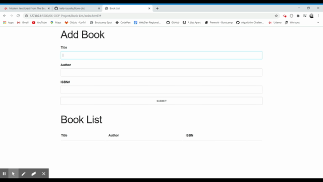

# Book-List

## About
Book List was created using vanilla JavaScript and then again using ES6 classes. Both are fully functional, for the purposes of this app it is set using ES6. 

## Languages Used
- HTML
- CSS
- JavaScript

## How to Use
The user can fork the repository and open the HTML document using Live Server or just open in their preferred browser. User can add a book title, author, and ISBN number to add to the book list.

## Features
- Text input fields created with validations so each field must be filled out. 
- User friendly pop-up messages to confirm with user what action has been completed. One for error, book added, and book removed. Messages appear for 3 seconds and then disappear. 
- Text clear from input fields after book submitted.
- Books saved to local storage upon submit.
- Books removed from local storage when deleted. 

## GIF 
